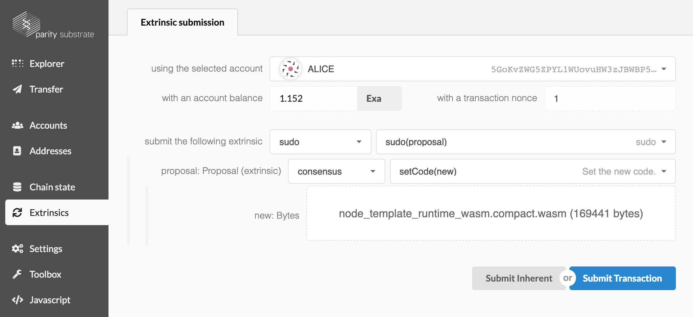
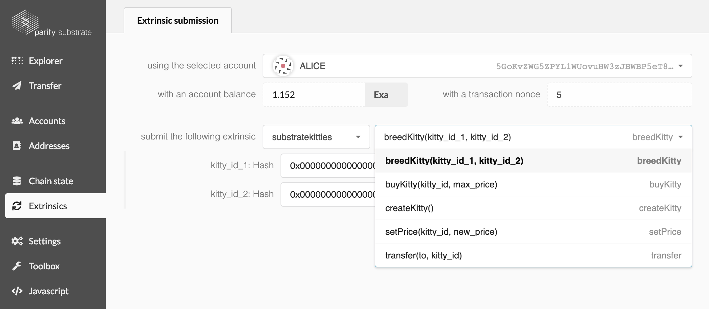

Breeding a Kitty
===

Probably the most unique part of the original CryptoKitties game is the ability to breed new kitties from existing ones.

We have prepared our `Kitty` object with this in mind, introducing `dna` and `gen` which will be used in forming brand new kitty offspring.

## Passing Down Traits

In our UI, we will be generating our kitties image using the kitty DNA. In our runtime, the DNA is a 256 bit hash, which is represented by as a bytearray in our code, and a hexadecimal string in our upcoming UI.

This means that there are 32 elements, each of which can be a value from 0 - 255. We will use these elements to determine which traits our kitties have. For example, the first index of the byte array can determine the color of our kitty (from a range of 256 colors); the next element could represent the eye shape, etc...

```
Attribute:  Color Eyes Hair Collar Accessory
DNA:        [233] [15] [166] [113] [67] ...
```

When we breed two kitties, we want the offspring to have some combination of the parent's genetics. What we will do for our game is randomly choose one of the parents to give their attribute to the child kitty.

```
Kitty1 DNA:   [212] [163] [106] [250] [251] [  0] [ 75]...
                |     |                       |
Child DNA:    [212] [163] [ 69] [195] [223] [  0] [201]
                            |     |     |           |
Kitty2 DNA:   [233] [ 49] [ 69] [195] [223] [133] [201]...
```

We provide you with the gene splicing algorithm in your template, but feel free to make modifications.

## Chain Upgrade (Optional)

One of the cool features of Substrate is the ability to do forkless, real-time chain upgrades which introduce new features and functionality to your blockchain without breaking existing nodes.

Rather than purging your chain and rebuilding the native binaries to introduce the `breed_kitty()` function, we will show you how you can use just the Wasm runtime to upgrade your chain.

Keep your node running from the previous section, and in a new terminal run just:

```
./scripts/build.sh
```

This will generate a new compact Wasm binary in the following path:

```
./runtime/wasm/target/wasm32-unknown-unknown/release/node_template_runtime_wasm.compact.wasm
```

We can now use this file in the Polkadot UI to upgrade your chain. Go to the **Extrinsics** app of the Polkadot UI, and select:

```
submit the following extrinsic: sudo > sudo(proposal)
    proposal: Proposal (extrinsic): consensus > setCode(new)
```



Then use the `compact.wasm` file as the input into this call. Make sure to call this function as **Alice** who was set in the genesis configuration to be the 'admin' allowed to make `Sudo` calls.

After you press **Submit Transaction** and a block is created, you should see a `Sudid` event appear showing that the contract upgrade was successful!


Finally, if we refresh the page and look at the extrinsics available in our Substratekitties module, we will find the `breedKitty()` function now appearing.



If you had any saved state before the upgrade (for example Kitties, balances, etc...), you will see that this state is preserved after the Runtime upgrade. At this point, your blockchain is running the Wasm version of the runtime through the Wasm interpreter provided by Substrate. This runtime lives on the blockchain, which means that it gets synced to all nodes running your chain, and thus keeps your network in sync with each other. Running Wasm in an interpreter is slower than running native code, so you can always do a full node upgrade by building a new executable with `cargo build --release` and restarting your node.

## Your Turn!

You will find that refactoring our `mint()` function in chapter 2 will help us a lot for this final step. Generate a new kitty using the gene splicing algorithm on two input kitties.

Make sure to increment the `gen` value to be one more than the max of the parent kitties. This way, we can keep track of breeded kitties versus one generated from scratch.

Then pass that kitty object to the `mint()` function to create your new kitty!

Finally, if you are feeling brave, do a live runtime upgrade to add this new feature to your blockchain. You should find that all of your existing storage items will be unaffected by the upgrade, however, you will now have access to this new function!

<!-- tabs:start -->

#### ** Template **

[embedded-code](./assets/3.4-template.rs ':include :type=code embed-template')

#### ** Solution **

[embedded-code-final](./assets/3.4-finished-code.rs ':include :type=code embed-final')

#### ** Previous Chapter Solution **

[embedded-code-previous](./assets/3.3-finished-code.rs ':include :type=code embed-previous')

<!-- tabs:end -->