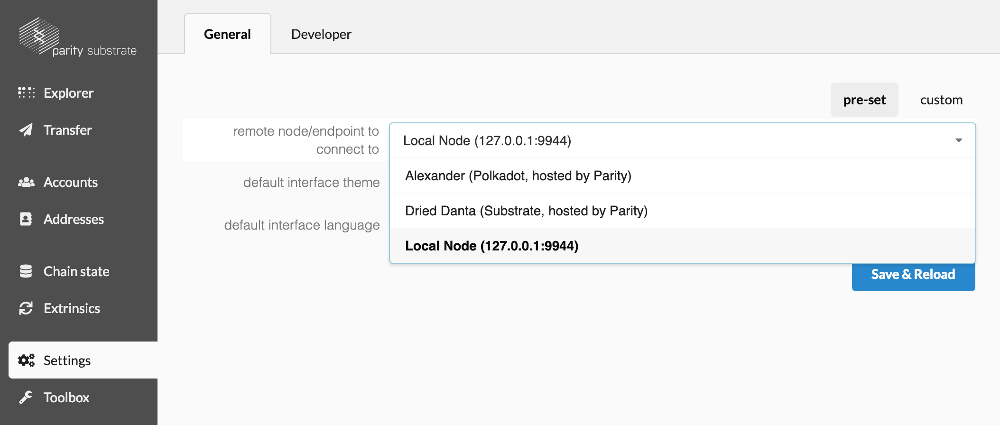
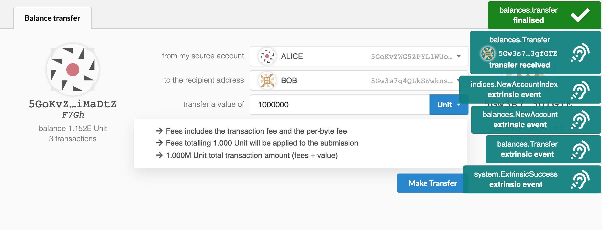

ノードを触ってみる
===

本ワークショップの終盤では、コレクタブルブロックチェーンとやり取りするためのカスタムUIを作成します。それまでの間は、[Polkadot-JS](https://polkadot.js.org)のアプリUIを使用します。これは公開されているテストネットやローカル環境のカスタムノードに適応するように一般化されたインターフェースです。

**Chrome** を開き、以下の場所に移動します。

You will need to clone a specific commit of the Polkadot-JS Apps UI: https://github.com/polkadot-js/apps/commit/38eebe7118f6385f120a1d53ce3b14a39cc9cb46

So run the following in your working directory:

```bash
git clone https://github.com/polkadot-js/apps/
git checkout 38eebe
yarn && yarn start
```

あなたのローカルノードとUIを接続するために、**Settings** のエンドポイントのドロップダウンから'Local Node(127.0.0.1:9944)'を選択します:

```
Settings > remote node/endpoint to connect to > Local Node (127.0.0.1:9944)
```



**Save and Reload** をクリックすると,Polkadot-JS Apps UIが動き始めます。
動かない場合は、先ほどの`./target/substratekitties --dev`でチェーンが動いていることを確認してください。

追加の定義を含むJSONファイルは、セクション1："構造体を確認する"の「カスタム構造体の登録」でインポートします。

アプリで **Transfer** に移動し、取引をしてみます。 "Alice"という名前のデフォルトのアカウントには、膨大な数の *Units* が事前に用意されています。

トランザクションを作成して、 "Bob"にも少し恵んであげましょう。取引が完了するとイベントが表示され、ボブの残高は更新されます。



まとめ：
今回のチュートリアルではローカルSubstrateチェーンのセットアップをあっという間にセットアップし、立ち上げ、触ってみました。

---
**発展**

[Substrate UI](https://github.com/paritytech/substrate-ui) は[oo7-substrate library](https://github.com/paritytech/oo7/tree/master/packages/oo7-substrate)を使って作られており、[Polkadot-JS Apps UI](https://github.com/polkadot-js/apps)の代替となるフロントエンドインターフェイスです。

あなたのカスタムUIを作るときは、[Polkadot-JS API Documentation](https://polkadot.js.org/api/)と[oo7 API Documentation](https://paritytech.github.io/oo7/)を参考にしてください。
